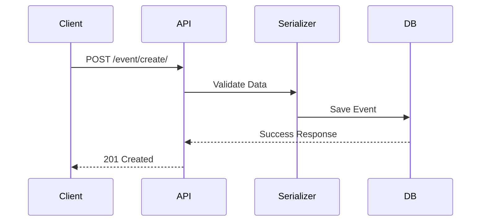

# Solution Design Document – EventHubBackEndV1

## 1. Overview

**Project Name:** EventHub  
**Purpose:** EventHub is a backend system for managing and organizing events, allowing users to create, view, and categorize events.  
**Audience:** Developers, testers, stakeholders interested in understanding the design and logic behind the backend functionality.

## 2. Objectives

- Enable creation and listing of events and categories
- Handle media (image) uploads for events
- Support RESTful API interactions
- Provide scalable structure for future features (e.g., ticketing, notifications)

## 3. System Components

### Backend Framework
- **Django 5.1.5**
- **DRF (Django REST Framework)**
- **drf-yasg** for API documentation

### Database
- **SQLite** (default, can be migrated to PostgreSQL or MySQL)

### Project Structure

```
eventhub/
│
├── event/
│   ├── api/                 → API views, serializers, urls
│   ├── migrations/          → DB schema migration files
│   ├── static/              → Static CSS files
│   ├── templates/           → HTML templates
│   └── templatetags/       → Custom template filters/tags
├── eventhub/                → Main Django config (settings, urls)
├── user/                    → Author model used in Event
├── stories/                 → Storybook components (frontend showcase)
``` 

## 4. Data Models

### Event Model

| Field        | Type            | Description |
|--------------|-----------------|-------------|
| id           | AutoField       | Primary key |
| name         | CharField       | Unique event name |
| slug         | SlugField       | Auto-generated URL slug |
| data         | DateTimeField   | Date of creation |
| image        | ImageField      | Event cover image |
| description  | TextField       | Optional description |
| author       | ForeignKey      | Linked to `user.Author` |
| category     | ForeignKey      | Linked to `event.Category` |

### Category Model

| Field        | Type            | Description |
|--------------|-----------------|-------------|
| id           | AutoField       | Primary key |
| name         | CharField       | Category name |
| slug         | SlugField       | Unique slug for the category |

## 5. API Endpoints

| Endpoint | Method | Description |
|----------|--------|-------------|
| `/eventlist/` | GET | List all events |
| `/event/<id>/` | GET | Get details of an event |
| `/event/create/` | POST | Create a new event |
| `/categorylist/` | GET | List all categories |
| `/category/<id>/` | GET | Get details of a category |
| `/category/create/` | POST | Create a new category |

### Request Example (POST /event/create/)
```json
{
  "name": "Music Fest 2025",
  "slug": "music-fest-2025",
  "image": "image file",
  "description": "An amazing outdoor concert",
  "author": 1,
  "category": 2
}
```

## 6. Functional Flow



## 7. Design Decisions

- **Class-based Views (CBV)** for scalability and reuse
- **APIView** for custom endpoints
- **Generic Views** (e.g., ListAPIView) for simple GET logic
- **SlugFields** ensure SEO-friendly URLs
- **MultiPartParser** used to support image upload

## 8. Security & Validation

- `serializer.is_valid()` ensures data integrity
- Use of `on_delete=PROTECT` on category prevents accidental deletion
- Image upload restricted via `ImageField` validation

## 9. Future Enhancements

- Authentication & permissions for event creators
- Ticket booking system
- Email notifications
- Pagination & filtering

## 10. Appendix

### Technologies Used

- Python 3.12
- Django
- DRF
- Swagger (drf-yasg)
- SQLite
- Storybook (frontend)
